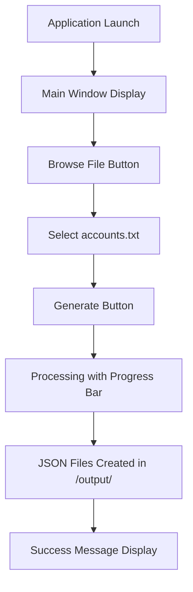

# Gmail OAuth Client JSON Generator - Product Requirements Document

## 1. Product Overview
Gmail OAuth Client JSON Generator হল একটি স্ট্যান্ডঅলোন ডেস্কটপ অ্যাপ্লিকেশন যা ইমেল/পাসওয়ার্ড তালিকা থেকে OAuth client JSON ফাইল তৈরি করে।
- এই অ্যাপ্লিকেশনটি Gmail API ইন্টিগ্রেশনের জন্য প্রয়োজনীয় OAuth client credentials সহজে তৈরি করতে সাহায্য করে।
- টার্গেট ইউজার: ডেভেলপার এবং টেকনিক্যাল ইউজার যারা একাধিক Gmail অ্যাকাউন্টের জন্য OAuth setup করতে চান।

## 2. Core Features

### 2.1 User Roles
এই অ্যাপ্লিকেশনে কোনো ইউজার রোল ডিস্টিংশন নেই - সকল ইউজার একই ফিচার ব্যবহার করতে পারবেন।

### 2.2 Feature Module
আমাদের Gmail OAuth Client JSON Generator অ্যাপ্লিকেশনে নিম্নলিখিত মূল পেজ রয়েছে:
1. **Main Application Window**: ফাইল সিলেকশন, প্রগ্রেস ট্র্যাকিং, JSON জেনারেশন কন্ট্রোল।

### 2.3 Page Details

| Page Name | Module Name | Feature description |
|-----------|-------------|---------------------|
| Main Application Window | File Selection Module | Browse এবং select করা accounts.txt ফাইল যেখানে email,password format এ ডেটা থাকবে |
| Main Application Window | Progress Tracking Module | Real-time progress bar এবং status message দেখানো প্রতিটি অ্যাকাউন্ট প্রসেসিংয়ের সময় |
| Main Application Window | JSON Generation Module | Generate বাটন চেপে প্রতিটি email/password pair এর জন্য OAuth client JSON ফাইল তৈরি করা |
| Main Application Window | Output Management Module | Generated JSON ফাইলগুলো /output/ ফোল্ডারে সেভ করা এবং completion message দেখানো |
| Main Application Window | Error Handling Module | Invalid file format বা processing error এর ক্ষেত্রে user-friendly error message প্রদর্শন |

## 3. Core Process

মূল ইউজার অপারেশন ফ্লো:
1. ইউজার .exe ফাইল ডাবল ক্লিক করে অ্যাপ্লিকেশন চালু করবেন
2. "Browse" বাটন চেপে accounts.txt ফাইল সিলেক্ট করবেন
3. "Generate" বাটন চেপে JSON ফাইল জেনারেশন প্রসেস শুরু করবেন
4. প্রগ্রেস বার দেখে অগ্রগতি ট্র্যাক করবেন
5. সফল সমাপনীর পর /output/ ফোল্ডারে generated JSON ফাইলগুলো পাবেন

## 4. User Interface Design

### 4.1 Design Style
- **Primary Colors**: #2196F3 (Blue), #4CAF50 (Green for success)
- **Secondary Colors**: #757575 (Gray for text), #F44336 (Red for errors)
- **Button Style**: Rounded corners with 3D effect
- **Font**: Arial, 12px for labels, 10px for status text
- **Layout Style**: Vertical layout with centered alignment
- **Icon Style**: Simple material design icons for browse and generate actions

### 4.2 Page Design Overview

| Page Name | Module Name | UI Elements |
|-----------|-------------|-------------|
| Main Application Window | File Selection Module | Label "Select Accounts File:", Entry field (read-only), Browse button (blue, rounded) |
| Main Application Window | Progress Tracking Module | Progress bar (horizontal, blue fill), Status label (gray text, center-aligned) |
| Main Application Window | JSON Generation Module | Generate button (green, large, rounded), centered placement |
| Main Application Window | Output Management Module | Success/Error message area (colored text), Output folder link (clickable, blue) |

### 4.3 Responsiveness
এই অ্যাপ্লিকেশনটি ডেস্কটপ-ফার্স্ট ডিজাইন করা হয়েছে। Fixed window size (600x400 pixels) এবং Windows desktop environment এর জন্য অপ্টিমাইজড।