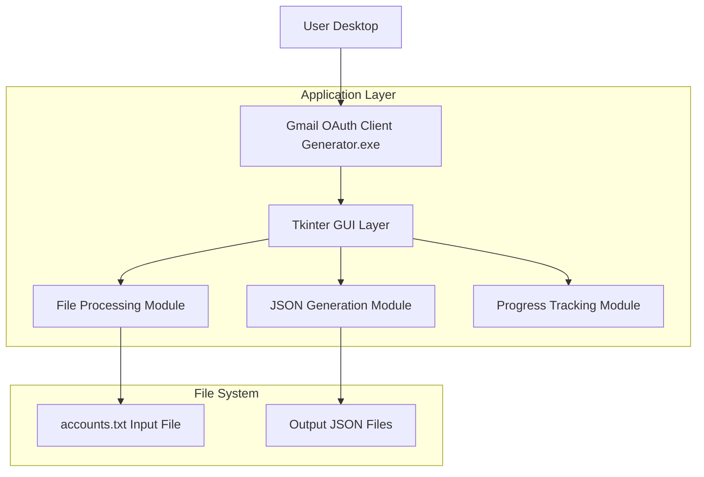
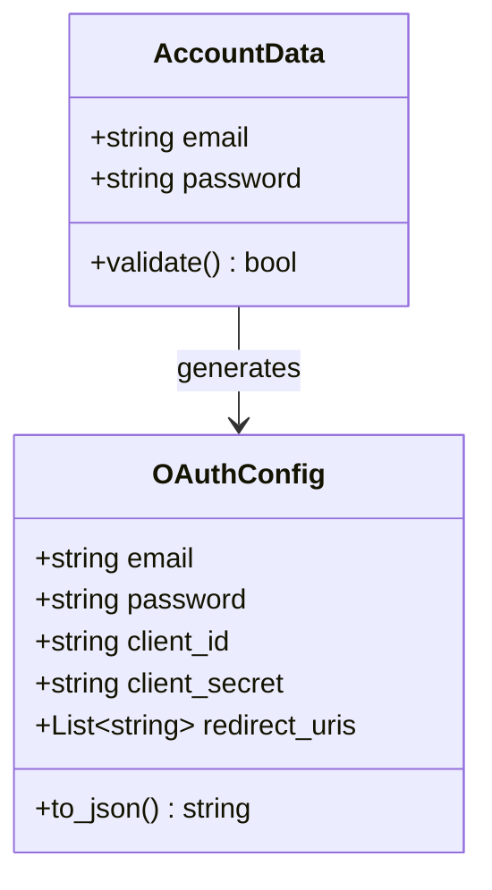

# Gmail OAuth Client JSON Generator - Technical Architecture Document

## 1. Architecture Design



## 2. Technology Description

- Frontend: Python 3.9+ + Tkinter (built-in GUI framework)
- Packaging: PyInstaller (for .exe generation)
- Libraries: google-auth, google-auth-oauthlib, google-auth-httplib2, google-api-python-client
- Backend: None (standalone desktop application)

## 3. Route Definitions

এই অ্যাপ্লিকেশনটি একটি single-window desktop application, তাই traditional web routes নেই। তবে application flow:

| Application State | Purpose |
|-------------------|----------|
| Initial State | Main window display with file selection option |
| File Selected State | Show selected file path and enable generate button |
| Processing State | Show progress bar and disable controls during generation |
| Completion State | Display success/error message and enable new operations |

## 4. API Definitions

এই অ্যাপ্লিকেশনে কোনো external API calls নেই। তবে internal function definitions:

### 4.1 Core Functions

**File Processing Function**
```python
def process_accounts_file(file_path: str) -> List[Dict[str, str]]
```

Input:
| Param Name | Param Type | isRequired | Description |
|------------|------------|------------|-------------|
| file_path | string | true | Path to accounts.txt file |

Output:
| Param Name | Param Type | Description |
|------------|------------|-------------|
| accounts | List[Dict] | List of email/password pairs |

**JSON Generation Function**
```python
def generate_oauth_json(email: str, password: str, output_dir: str) -> bool
```

Input:
| Param Name | Param Type | isRequired | Description |
|------------|------------|------------|-------------|
| email | string | true | Gmail email address |
| password | string | true | Account password |
| output_dir | string | true | Output directory path |

Output:
| Param Name | Param Type | Description |
|------------|------------|-------------|
| success | boolean | Generation success status |

## 5. Server Architecture Diagram

এই অ্যাপ্লিকেশনে কোনো server-side architecture নেই কারণ এটি একটি standalone desktop application।

## 6. Data Model

### 6.1 Data Model Definition

এই অ্যাপ্লিকেশনে কোনো database নেই। শুধুমাত্র file-based data processing:



### 6.2 Data Definition Language

কোনো database DDL নেই। তবে file formats:

**Input File Format (accounts.txt)**
```
email1@gmail.com,password1
email2@gmail.com,password2
email3@gmail.com,password3
```

**Output JSON Format**
```json
{
  "email": "email1@gmail.com",
  "password": "password1",
  "client_id": "YOUR_CLIENT_ID",
  "client_secret": "YOUR_CLIENT_SECRET",
  "redirect_uris": ["http://localhost"]
}
```

**Directory Structure**
```
gmail-oauth-client-generator/
├── main.py                    # Main application file
├── accounts.txt               # Sample input file
├── output/                    # Generated JSON files directory
│   ├── email1@gmail.com.json
│   ├── email2@gmail.com.json
│   └── ...
├── build/                     # PyInstaller build files
└── dist/                      # Final .exe output
    └── Gmail_OAuth_Generator.exe
```